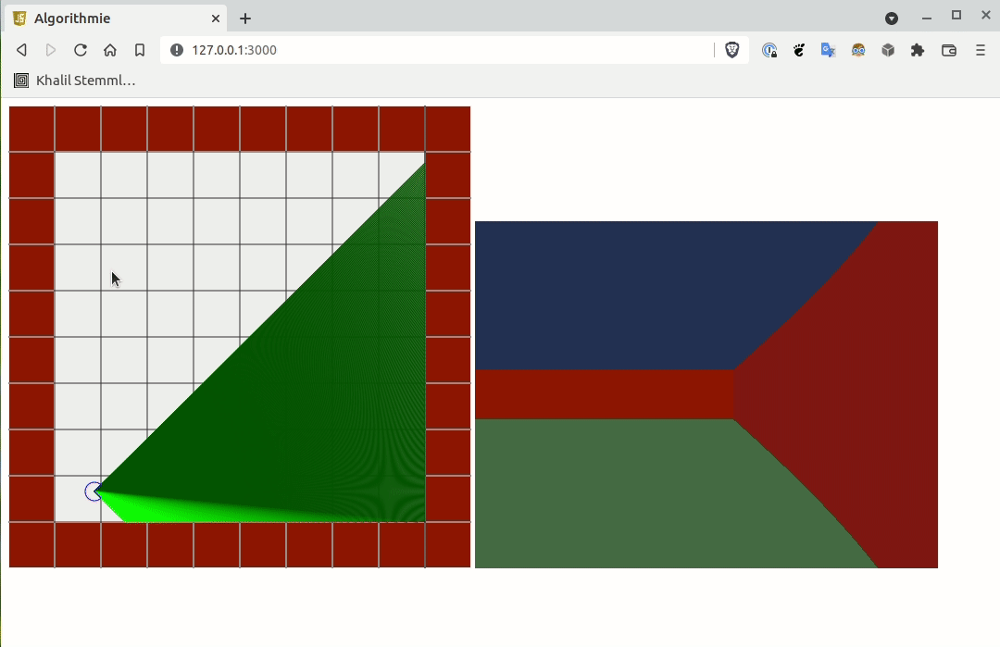

# Cours Algo du 16/11/2021 - Projet final: Raycaster




## Parenthèse retro

[Wolfeinstein 3D](https://youtu.be/7P_dic-pSKo) est un jeu vidéo sortit en 1992 par la société 3D Realms et sur lequel ont travaillés John Romero et John Carmack (-> juste le père de presque toute la 3D actuelle dans l'industrie du jeux vidéo, c'est un trés bon développeur)

A cette époque, les meilleures machines pour jouer étaient des avec des CPU 32 bits cadencés au mieux à 40MHz, au mieux 200 Mo de disque dur et toujours au mieux 4 Mo de RAM. On parle d'un temps ou les cartes graphiques accélérées (c'est à dire avec un GPU puissant sur la 3D) n'existaient pas et quand vous dépensiez de l'argent sur votre machine, c'était pour acheter une "carte son" qui vous permettait d'entendre des bruitages normaux plutot que les seuls BIPs dont était capables les PCs de l'époque.

Ces spécifications sont encore un peu limite pour faire un rendu 3D temps réel, même simple, comme on les a connus ensuite.
Pourtant Wolfeinstein 3D était un jeu 3D temps réel qui a bluffé tout le monde à l'époque.

Alors comment Romero et Carmack ont ils fait?

Et bien en fait, ils n'ont pas réellement programmé un rendu 3D temps réel au sens où tout le monde l'entend. A la place, ils ont programmé une approximation de rendu 3D (qu'on a surnomé plus tard de la "2,5D") Leur moteur adaptait en fait une technique appelé le "Ray casting" pour imité un rendu 3D, sous certaines contraintes.

## Objectif
Programmer "from scratch", sans librairies tierces ni aide d'aucune sorte, un moteur équivalent fonctionnant dans un navigateur récent et pouvant tourner à au moins 30 fps (mais idéalement + de 60fps)

Il est demandé à ce moteur de simplement savoir afficher un sol, un plafond et des murs unis, sans textures.

Pour ce faire, au préalable, nous développerons aussi une vue 2D de la carte dans lequel notre point de vue 3D évoluera. Dans cette vue 2D, nous pourrons ajouter et retirer des murs.


## TODO:
* Fixer un léger bug visuel. Il y a un léger effet fisheye visible quand on s'approche de face d'un mur tout droit. Sur les côtés gauche et droit de la vue 3D, les murs semblent se rapprocher un peu plus vite qu'au centre de l'image. L'origine probable du problème vient du pré-calcul des angles des rayons à lancer.
* Commenter le code
* Réécrire la fonction de cast d'un rayon qui est trop longue
* Implémenter la détection de colision dans les murs pour éviter de passer au travers

## TODO (future release):
* Implémenter le texturing des murs
* Implémenter le texturing des sols et plafonds
* Ajouter dans les controles, un déplacement latéral
* Implémenter un serveur de jeu mémorisant l'état d'une partie dont les positions des joueurs
* Revenir sur le texturing des murs pour implémenter la transparence de zone dans les textures
* Implémenter le client du serveur de jeu et exporter l'état d'une partie dans le serveur

## Vision
Faire un clone du jeu Among Us, affiché en mode Wolfeinstein 3D

## Lancement
De temps en temps pour mettre a jour les deps et la première fois après le clonage du dépot:

```
npm install
```

Pour lancer le serveur:

```
clear && npm run start:dev
```

Par défaut le serveur web écoute sur http://127.0.0.1:3000/